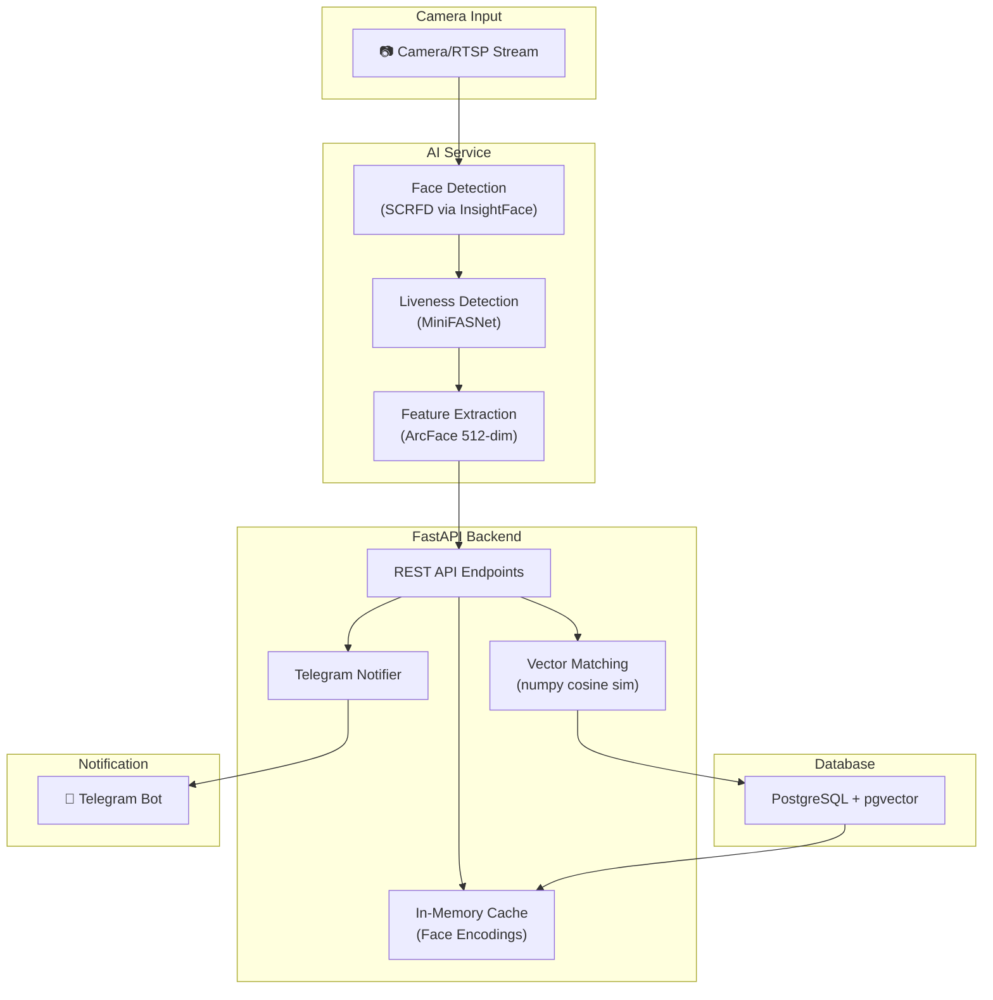
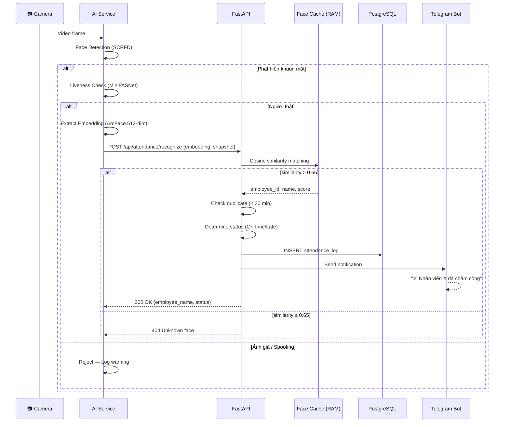

# IDVision — Hệ Thống Chấm Công Bằng Nhận Diện Khuôn Mặt AI

Hệ thống chấm công thời gian thực sử dụng nhận diện khuôn mặt (hỗ trợ khẩu trang), với FastAPI backend, PostgreSQL + pgvector, và thông báo qua Telegram Bot.

---

## Kiến Trúc Tổng Quan



---

## User Review Required

> [!IMPORTANT]
> **Lựa chọn Model AI**: Plan sử dụng **InsightFace `buffalo_l`** (ArcFace, 512-dim embedding). Model này cung cấp face detection (SCRFD) + recognition trong một package duy nhất, hoạt động tốt với khuôn mặt đeo khẩu trang khi tập trung vào vùng mắt và trán. Bạn có muốn thay đổi model khác không?

> [!IMPORTANT]
> **Anti-Spoofing**: Plan bao gồm module **MiniFASNet** (Silent Face Anti-Spoofing) để chống giả mạo bằng ảnh/video. Module này lightweight, chạy được trên CPU. Bạn có muốn bỏ qua tính năng này trong MVP đầu tiên không?

> [!WARNING]
> **Telegram Bot Token**: Bạn cần tạo bot qua [@BotFather](https://t.me/BotFather) trước khi chạy hệ thống. Plan sẽ sử dụng biến môi trường `TELEGRAM_BOT_TOKEN` và `TELEGRAM_CHAT_ID`.

---

## Open Questions

> [!IMPORTANT]
> 1. **Nguồn Camera**: Hệ thống sẽ dùng webcam (USB), RTSP stream từ camera IP, hay cả hai? Điều này ảnh hưởng tới cấu hình OpenCV capture.
> 2. **Số lượng nhân viên dự kiến**: Ít hơn 100 hay hàng nghìn? Ảnh hưởng tới chiến lược cache và matching.
> 3. **Giờ làm việc chuẩn**: Giờ vào ca mặc định (ví dụ 08:00) để xác định trạng thái "Đi trễ"?
> 4. **Triển khai GPU hay CPU-only?**: InsightFace hỗ trợ cả hai, nhưng GPU cho tốc độ tốt hơn nhiều với real-time video.

---

## Proposed Changes

### Cấu trúc thư mục dự án

```
e:\IDVision\
├── docker-compose.yml
├── .env.example
├── README.md
│
├── backend/                    # FastAPI Backend
│   ├── Dockerfile
│   ├── requirements.txt
│   ├── main.py                 # FastAPI app + lifespan
│   ├── config.py               # Cấu hình hệ thống
│   ├── database.py             # SQLAlchemy + pgvector setup
│   ├── models.py               # ORM models (Employee, AttendanceLog)
│   ├── schemas.py              # Pydantic schemas
│   ├── routers/
│   │   ├── __init__.py
│   │   ├── employees.py        # CRUD nhân viên
│   │   ├── attendance.py       # Chấm công endpoints
│   │   └── enrollment.py       # Đăng ký khuôn mặt
│   ├── services/
│   │   ├── __init__.py
│   │   ├── face_cache.py       # In-memory face encoding cache
│   │   ├── matcher.py          # Vector matching logic
│   │   └── telegram_bot.py     # Telegram notification
│   └── alembic/                # Database migrations
│       ├── alembic.ini
│       └── versions/
│
├── ai_service/                 # AI/Vision Module
│   ├── Dockerfile
│   ├── requirements.txt
│   ├── face_detector.py        # InsightFace wrapper
│   ├── liveness.py             # Anti-spoofing (MiniFASNet)
│   ├── camera_stream.py        # Camera capture + processing loop
│   └── models/                 # Pre-trained model files (auto-download)
│
├── db/                         # Database initialization
│   └── init.sql                # pgvector extension + schema
│
└── scripts/
    └── enroll_face.py          # Script đăng ký khuôn mặt nhân viên
```

---

### Component 1: Database (PostgreSQL + pgvector)

#### [NEW] [init.sql](file:///e:/IDVision/db/init.sql)
Schema khởi tạo database:

```sql
CREATE EXTENSION IF NOT EXISTS vector;

CREATE TABLE employees (
    id SERIAL PRIMARY KEY,
    name VARCHAR(255) NOT NULL,
    employee_code VARCHAR(50) UNIQUE,
    telegram_chat_id VARCHAR(50),
    face_encoding VECTOR(512),         -- ArcFace 512-dim embedding
    enrolled_at TIMESTAMP DEFAULT NOW(),
    is_active BOOLEAN DEFAULT TRUE
);

CREATE TABLE attendance_logs (
    id SERIAL PRIMARY KEY,
    employee_id INTEGER REFERENCES employees(id),
    check_in_time TIMESTAMP NOT NULL DEFAULT NOW(),
    status VARCHAR(50) NOT NULL,       -- 'SUCCESS' / 'LATE' / 'LOW_CONFIDENCE'
    confidence FLOAT,                  -- Cosine similarity score
    snapshot_path VARCHAR(500),        -- Ảnh chụp lúc chấm công
    created_at TIMESTAMP DEFAULT NOW()
);

-- HNSW index cho tìm kiếm vector nhanh
CREATE INDEX idx_face_encoding ON employees 
    USING hnsw (face_encoding vector_cosine_ops);

-- Index cho truy vấn attendance theo ngày
CREATE INDEX idx_attendance_date ON attendance_logs (check_in_time);
CREATE INDEX idx_attendance_employee ON attendance_logs (employee_id);
```

**Thiết kế chính:**
- `face_encoding VECTOR(512)`: Lưu 512-dim ArcFace embedding trực tiếp trong PostgreSQL
- **HNSW index**: Approximate Nearest Neighbor search cho performance O(log n) thay vì O(n)
- `confidence`: Lưu lại cosine similarity score để audit và tinh chỉnh threshold sau
- `snapshot_path`: Lưu ảnh chụp tại thời điểm chấm công để xác minh thủ công khi cần

---

### Component 2: AI Service (Masked Face Recognition)

#### [NEW] [face_detector.py](file:///e:/IDVision/ai_service/face_detector.py)
Wrapper InsightFace sử dụng `buffalo_l` model pack:
- **Face Detection**: SCRFD (có trong buffalo_l) - chính xác hơn MTCNN, nhanh hơn RetinaFace
- **Feature Extraction**: ArcFace (có trong buffalo_l) - 512-dim normalized embedding
- Xử lý ảnh: resize frame, detect faces, extract embeddings
- Trả về list `FaceResult(bbox, embedding, landmarks, det_score)`

#### [NEW] [liveness.py](file:///e:/IDVision/ai_service/liveness.py)
Anti-spoofing module:
- Sử dụng **MiniFASNet** (ONNX) - lightweight, chạy CPU
- Input: cropped face image → Output: `is_real: bool, score: float`
- Threshold mặc định: 0.5 (có thể tinh chỉnh qua config)

#### [NEW] [camera_stream.py](file:///e:/IDVision/ai_service/camera_stream.py)
Camera processing loop:
- Capture frames từ webcam/RTSP
- Motion detection (optional) để giảm tải xử lý
- Khi phát hiện khuôn mặt → extract embedding → gọi Backend API `/api/attendance/recognize`
- Rate limiting: chỉ gửi recognition request mỗi 3 giây/người để tránh duplicate

**Công nghệ:**
| Thành phần | Thư viện | Lý do |
|---|---|---|
| Face Detection + Recognition | `insightface` (buffalo_l) | All-in-one, SOTA accuracy, ONNX optimized |
| Anti-Spoofing | MiniFASNet (ONNX) | Lightweight, passive liveness, CPU-friendly |
| Camera Capture | `opencv-python` | Industry standard, RTSP support |
| Inference Runtime | `onnxruntime` / `onnxruntime-gpu` | Fast inference, cross-platform |

---

### Component 3: FastAPI Backend

#### [NEW] [main.py](file:///e:/IDVision/backend/main.py)
FastAPI application với lifespan:
- Startup: Load face encodings vào cache, khởi tạo Telegram bot
- Shutdown: Cleanup connections
- CORS middleware cho frontend (nếu cần)
- Include routers: employees, attendance, enrollment

#### [NEW] [config.py](file:///e:/IDVision/backend/config.py)
Pydantic Settings:
```python
class Settings(BaseSettings):
    DATABASE_URL: str
    TELEGRAM_BOT_TOKEN: str
    TELEGRAM_CHAT_ID: str           # Group chat ID cho thông báo
    SIMILARITY_THRESHOLD: float = 0.65   # Cosine similarity threshold
    LATE_THRESHOLD_HOUR: int = 8         # Giờ vào ca
    LATE_THRESHOLD_MINUTE: int = 0
    ANTI_SPOOFING_ENABLED: bool = True
    DUPLICATE_CHECK_MINUTES: int = 30    # Chống chấm công trùng
```

#### [NEW] [database.py](file:///e:/IDVision/backend/database.py)
SQLAlchemy async setup với pgvector:
- `asyncpg` driver cho async operations
- `pgvector.sqlalchemy` extension integration

#### [NEW] [models.py](file:///e:/IDVision/backend/models.py)
SQLAlchemy ORM models:
- `Employee`: id, name, employee_code, telegram_chat_id, face_encoding (Vector(512)), is_active
- `AttendanceLog`: id, employee_id, check_in_time, status, confidence, snapshot_path

#### [NEW] [schemas.py](file:///e:/IDVision/backend/schemas.py)
Pydantic schemas:
- `EmployeeCreate`, `EmployeeResponse`, `EmployeeEnroll`
- `AttendanceResponse`, `RecognitionRequest`, `RecognitionResult`

#### [NEW] [routers/employees.py](file:///e:/IDVision/backend/routers/employees.py)
CRUD endpoints:
- `POST /api/employees` — Tạo nhân viên mới
- `GET /api/employees` — Danh sách nhân viên
- `GET /api/employees/{id}` — Chi tiết nhân viên
- `PUT /api/employees/{id}` — Cập nhật thông tin
- `DELETE /api/employees/{id}` — Soft delete (is_active = false)

#### [NEW] [routers/enrollment.py](file:///e:/IDVision/backend/routers/enrollment.py)
Face enrollment endpoints:
- `POST /api/enrollment/{employee_id}` — Upload 3-5 ảnh khuôn mặt
  - Detect faces, extract embeddings cho mỗi ảnh
  - Tính **average embedding** (normalized) từ tất cả ảnh
  - Lưu vào `employees.face_encoding`
  - Cập nhật in-memory cache
- `DELETE /api/enrollment/{employee_id}` — Xóa face encoding

#### [NEW] [routers/attendance.py](file:///e:/IDVision/backend/routers/attendance.py)
Attendance endpoints:
- `POST /api/attendance/recognize` — **Core endpoint**
  - Nhận embedding vector từ AI service
  - So khớp với cache bằng **cosine similarity (numpy)**
  - Nếu similarity > threshold (0.65): xác nhận danh tính
  - Kiểm tra duplicate: không chấm công lại trong 30 phút
  - Xác định status: `SUCCESS` (≤ 08:00) / `LATE` (> 08:00) / `LOW_CONFIDENCE` (0.5-0.65)
  - INSERT vào `attendance_logs`
  - Trigger Telegram notification
- `GET /api/attendance/today` — Danh sách chấm công hôm nay
- `GET /api/attendance/report` — Báo cáo theo khoảng thời gian

#### [NEW] [services/face_cache.py](file:///e:/IDVision/backend/services/face_cache.py)

> [!TIP]
> **Chiến lược tối ưu performance**: Thay vì query pgvector cho mỗi frame, cache toàn bộ face encodings trên RAM. Với 1000 nhân viên × 512 floats × 4 bytes = ~2MB RAM — rất nhỏ.

```python
class FaceCache:
    """In-memory cache of all employee face encodings for fast matching."""
    _encodings: np.ndarray      # Shape: (N, 512)
    _employee_ids: list[int]
    _employee_names: list[str]
    
    async def load_from_db(self, session) -> None: ...
    async def refresh(self, session) -> None: ...
    def match(self, query_embedding: np.ndarray) -> MatchResult | None: ...
```

- Load tất cả `face_encoding` lên RAM khi server startup
- Refresh cache khi có enrollment mới
- `match()`: tính cosine similarity bằng numpy vectorized operations — **cực nhanh** (< 1ms cho 1000 nhân viên)

#### [NEW] [services/matcher.py](file:///e:/IDVision/backend/services/matcher.py)
Vector matching logic:
- Cosine similarity: `similarity = dot(a, b) / (norm(a) * norm(b))`
- Trả về `(employee_id, name, similarity_score)` nếu vượt threshold
- Fallback: nếu cache miss, query trực tiếp pgvector

#### [NEW] [services/telegram_bot.py](file:///e:/IDVision/backend/services/telegram_bot.py)
Telegram integration:
- Sử dụng `python-telegram-bot` v20+ (async native)
- Khởi tạo qua FastAPI lifespan
- Function `send_attendance_notification()`:
  ```
  ✅ [IDVision] Nhân viên {name} đã chấm công thành công.
  Giờ vào ca: {time} ngày {date}.
  ```
- Function `send_late_notification()`:
  ```
  ⚠️ [IDVision] Nhân viên {name} đến trễ.
  Giờ vào: {time} ngày {date} (Trễ {minutes} phút).
  ```
- Gửi tin nhắn vào group chat **và** tin nhắn riêng cho nhân viên (nếu có `telegram_chat_id`)

---

### Component 4: Enrollment Script

#### [NEW] [enroll_face.py](file:///e:/IDVision/scripts/enroll_face.py)
Script CLI đăng ký khuôn mặt:
- Chụp 5 ảnh từ webcam (đếm ngược 3-2-1)
- Detect và extract embedding cho mỗi ảnh
- Tính average normalized embedding
- Upload lên `/api/enrollment/{employee_id}`
- Hỗ trợ chụp cả đeo và không đeo khẩu trang

---

### Component 5: Docker Deployment

#### [NEW] [docker-compose.yml](file:///e:/IDVision/docker-compose.yml)
```yaml
services:
  db:
    image: pgvector/pgvector:pg16
    volumes:
      - pgdata:/var/lib/postgresql/data
      - ./db/init.sql:/docker-entrypoint-initdb.d/init.sql
    environment:
      POSTGRES_DB: idvision
      POSTGRES_USER: idvision
      POSTGRES_PASSWORD: ${DB_PASSWORD}
    ports:
      - "5432:5432"

  backend:
    build: ./backend
    depends_on:
      - db
    env_file: .env
    ports:
      - "8000:8000"
    volumes:
      - ./snapshots:/app/snapshots

  ai_service:
    build: ./ai_service
    depends_on:
      - backend
    env_file: .env
    devices:
      - /dev/video0:/dev/video0   # Webcam passthrough (Linux)
    volumes:
      - ./ai_service/models:/app/models
```

#### [NEW] [backend/Dockerfile](file:///e:/IDVision/backend/Dockerfile)
```dockerfile
FROM python:3.11-slim
RUN apt-get update && apt-get install -y libpq-dev gcc
WORKDIR /app
COPY requirements.txt .
RUN pip install --no-cache-dir -r requirements.txt
COPY . .
CMD ["uvicorn", "main:app", "--host", "0.0.0.0", "--port", "8000"]
```

#### [NEW] [ai_service/Dockerfile](file:///e:/IDVision/ai_service/Dockerfile)
```dockerfile
FROM python:3.11-slim
RUN apt-get update && apt-get install -y libgl1-mesa-glx libglib2.0-0
WORKDIR /app
COPY requirements.txt .
RUN pip install --no-cache-dir -r requirements.txt
COPY . .
CMD ["python", "camera_stream.py"]
```

#### [NEW] [.env.example](file:///e:/IDVision/.env.example)
```env
DATABASE_URL=postgresql+asyncpg://idvision:password@db:5432/idvision
TELEGRAM_BOT_TOKEN=your_bot_token_here
TELEGRAM_CHAT_ID=your_group_chat_id
DB_PASSWORD=your_secure_password
SIMILARITY_THRESHOLD=0.65
CAMERA_SOURCE=0
BACKEND_URL=http://backend:8000
```

---

## Luồng Hoạt Động Chi Tiết



---

## Xử Lý Rủi Ro Kỹ Thuật

| Thách thức | Giải pháp trong plan |
|---|---|
| **False Positive (nhận nhầm)** | Threshold mặc định 0.65, có thể tăng lên 0.70-0.75. Lưu `confidence` score để audit. Khuyến khích enrollment 5 ảnh (đeo + không đeo khẩu trang) |
| **Quá tải Database** | Cache face encodings trên RAM (~2MB cho 1000 NV). Match bằng numpy vectorized trên Backend. Chỉ ghi log xuống DB. pgvector chỉ dùng làm fallback |
| **Anti-Spoofing** | MiniFASNet (ONNX) — passive liveness detection, không cần user interaction. Detect ảnh in, video replay, màn hình điện thoại |
| **Duplicate check-in** | Cooldown 30 phút giữa 2 lần chấm công của cùng một nhân viên |
| **Ánh sáng kém** | InsightFace buffalo_l xử lý tốt low-light. Có thể thêm CLAHE preprocessing nếu cần |

---

## Verification Plan

### Automated Tests
1. **Unit tests**: Test matching logic, threshold, duplicate check
2. **Integration test**: Enrollment → Recognition flow end-to-end
3. **Build verification**: `docker-compose build` thành công
4. **API test**: Gọi tất cả endpoints qua `/docs` (Swagger UI)

### Manual Verification
1. **Enrollment test**: Đăng ký 2-3 khuôn mặt qua script/API
2. **Recognition test**: Nhận diện qua webcam real-time
3. **Mask test**: Test nhận diện khi đeo khẩu trang
4. **Telegram test**: Xác nhận nhận được thông báo trên Telegram
5. **Spoofing test**: Thử dùng ảnh trên điện thoại để xác nhận anti-spoofing hoạt động
6. **Late detection**: Test chấm công sau giờ quy định

---

## Dependencies Tổng Hợp

### Backend (`requirements.txt`)
```
fastapi==0.115.*
uvicorn[standard]
sqlalchemy[asyncio]==2.0.*
asyncpg
pgvector
alembic
python-telegram-bot==21.*
numpy
scipy
pydantic-settings
python-multipart
aiofiles
Pillow
```

### AI Service (`requirements.txt`)
```
insightface
onnxruntime          # hoặc onnxruntime-gpu
opencv-python-headless
numpy
httpx                # Async HTTP client để gọi Backend API
Pillow
```
